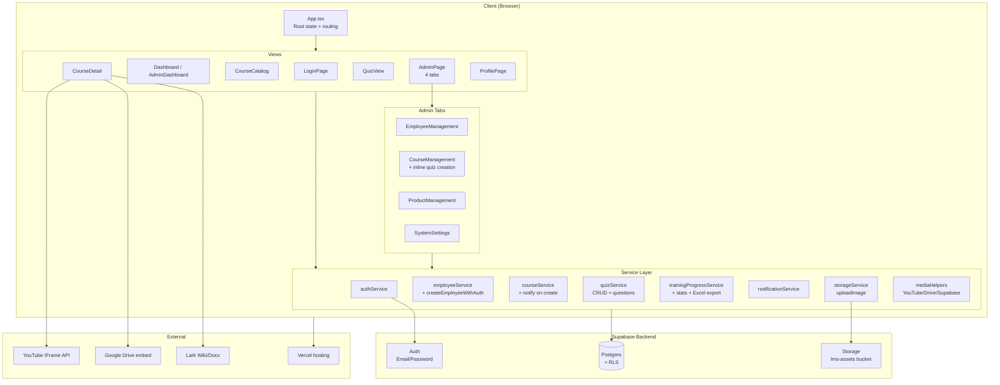
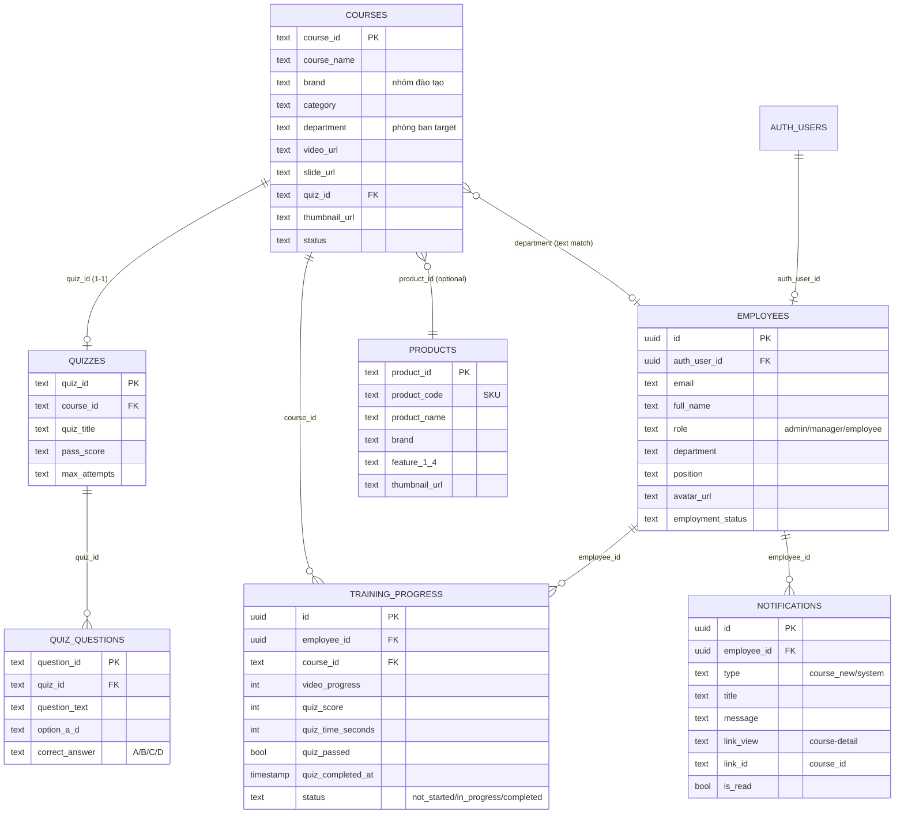

# Sơ đồ kiến trúc — DOSCOM Academy LMS

Hệ thống đào tạo nội bộ Doscom Enterprise. Frontend React + Vite, backend Supabase (Postgres + Auth + Storage), hosting Vercel.

> **Production**: https://hethongdaotao.vercel.app
> **Tech stack**: React 19 · Vite 6 · TypeScript · TailwindCSS · Supabase JS SDK · Recharts · xlsx · lucide-react

---

## 1. Tổng quan kiến trúc

```
┌──────────────────────────────────────────────────────────────────────┐
│                        CLIENT (Browser)                               │
│  ┌────────────────────────────────────────────────────────────────┐ │
│  │  React 19 + Vite + TailwindCSS + TypeScript + Recharts          │ │
│  │                                                                   │ │
│  │  ┌─ VIEWS ────────────┐  ┌─ COMPONENTS ─────────────────────┐ │ │
│  │  │ Auth (Login/Reset)  │  │ Sidebar | Navbar(Bell,Search)    │ │ │
│  │  │ Dashboard (Emp+Adm) │  │ AdminModal | Dropdown            │ │ │
│  │  │ Product Catalog     │  │ ImageUpload | UI primitives      │ │ │
│  │  │ Course Catalog      │  └──────────────────────────────────┘ │ │
│  │  │ Course Detail       │                                         │ │
│  │  │ QuizView            │  ┌─ SERVICE LAYER ──────────────────┐ │ │
│  │  │ Profile             │  │ authService                       │ │ │
│  │  │ Admin (4 tabs)      │  │ employeeService                   │ │ │
│  │  └─────────────────────┘  │ courseService                     │ │ │
│  │                            │ productService                    │ │ │
│  │  ┌─ LOCAL STORAGE ────┐   │ quizService                       │ │ │
│  │  │ video_progress     │   │ trainingProgressService           │ │ │
│  │  │ quiz_attempts      │   │ notificationService               │ │ │
│  │  │ system_settings    │   │ storageService                    │ │ │
│  │  └────────────────────┘   │ mediaHelpers (URL converters)     │ │ │
│  │                            │ supabaseClient                    │ │ │
│  │                            └───────────────────────────────────┘ │ │
│  └────────────────────────────────────────────────────────────────┘ │
└────────────────────────────┬─────────────────────────────────────────┘
                             │ HTTPS (Supabase JS SDK)
                             ▼
┌──────────────────────────────────────────────────────────────────────┐
│                       SUPABASE (Backend)                              │
│                                                                        │
│  ┌─ AUTH ────────────────────┐  ┌─ STORAGE ───────────────────────┐ │
│  │ Email/Password + JWT       │  │ Bucket: lms-assets/              │ │
│  │ persistSession             │  │  ├─ avatars/                     │ │
│  │ autoRefreshToken           │  │  ├─ course-thumbnails/           │ │
│  │ resetPasswordForEmail      │  │  └─ product-thumbnails/          │ │
│  └────────────────────────────┘  │ Public read, auth-only write     │ │
│                                    └──────────────────────────────────┘ │
│  ┌─ POSTGRES (Row Level Security) ─────────────────────────────────┐ │
│  │  employees ◄─── auth_user_id (FK auth.users)                     │ │
│  │  courses ◄─────── department, quiz_id (link to quizzes)          │ │
│  │  products                                                          │ │
│  │  quizzes ◄─────── course_id                                       │ │
│  │  quiz_questions ◄ quiz_id                                          │ │
│  │  training_progress (employee × course composite)                   │ │
│  │  notifications ◄── employee_id                                     │ │
│  └────────────────────────────────────────────────────────────────────┘ │
└──────────────────────────────────────────────────────────────────────┘
                             │
                             ▼
┌──────────────────────────────────────────────────────────────────────┐
│                    EXTERNAL INTEGRATIONS                               │
│  • YouTube IFrame API — track currentTime/duration video YouTube      │
│  • Google Drive — embed slide/video qua /preview                      │
│  • Lark Wiki/Docx — embed tài liệu nội bộ qua iframe                  │
│  • Vercel — hosting + CI/CD auto-deploy from git                      │
└──────────────────────────────────────────────────────────────────────┘
```

---

## 2. Component diagram (Mermaid)



---

## 3. Database schema



---

## 4. Data flow — 3 user flow chính

### A. Nhân viên xem khóa học có video + quiz

```
User mở Course Detail
   │
   ├─► YouTube IFrame API gắn vào iframe
   │      └─► Poll currentTime/duration mỗi 2s khi PLAYING
   │              └─► localStorage + Supabase upsert (debounced 2s)
   │
   ├─► User click "Bắt đầu làm quiz"
   │      └─► getQuizByCourseId() → load câu hỏi → render QuizView
   │
   └─► Submit quiz
          ├─► saveQuizToSupabase() → training_progress.quiz_*
          ├─► saveQuizAttempt() → localStorage
          ├─► persistQuizResult() → cập nhật courses state
          └─► navigate Course Detail
                  └─► hiển thị progress 100% (video + quiz đều xong)
```

### B. Admin tạo khóa học mới + quiz inline

```
Admin click "Thêm khóa học" trong CourseManagement
   │
   ├─► Form: course_id, name, brand, department, video, slide
   ├─► Toggle "Thêm quiz" → expand 10 slot câu hỏi
   │
   └─► Submit
          ├─► createCourse() with quiz_id pre-derived = Q_xxx
          │      └─► notifyEmployeesAboutCourse() → insert N notifications
          ├─► createQuiz() with course_id linked
          ├─► loop createQuestion() cho mỗi slot có content
          └─► onDataChanged() → App.initData(silent=true) refresh
                  └─► nhân viên phòng đó thấy bell 🔔 + course mới
```

### C. Nhân viên đổi avatar

```
User click avatar trong Profile
   │
   ├─► File picker → chọn ảnh
   ├─► storageService.uploadImage(file, 'avatars')
   │      └─► Supabase Storage: lms-assets/avatars/<timestamp>-<hash>-<name>
   │              └─► return public URL
   │
   └─► employeeService.updateEmployee(id, { avatar_url: url })
          ├─► RLS check: auth_user_id = auth.uid()
          ├─► Postgres UPDATE
          └─► onEmployeeUpdate(emp) → setEmployee state global
                  └─► Sidebar + Profile re-render với ảnh mới
```

---

## 5. Auth & RLS flow

```
User → LoginPage
   │
   ├─► supabase.auth.signInWithPassword()
   │      └─► trả về { user, session } (JWT)
   │
   ├─► getEmployeeProfile(authUserId)
   │      └─► SELECT * FROM employees WHERE auth_user_id = auth.uid()
   │              └─► RLS policy: authenticated_select_employees
   │
   ├─► Check must_change_password → force ResetPassword
   │
   └─► initData()
          ├─► getProducts() / getCourses() → filter theo role + department
          ├─► getNotifications(emp.id) → bell badge
          └─► setEmployee(emp) → render Layout
```

---

## 6. Cấu trúc thư mục source

```
src/
├── App.tsx                          # Root: state, routing, initData
├── main.tsx                         # Entry, mount React
├── index.css                        # Tailwind base
├── types.ts                         # ViewType enum, Employee/Course/Product/Quiz interfaces
│
├── lib/
│   └── utils.ts                     # cn() helper (clsx + tailwind-merge)
│
├── services/                        # ── BUSINESS LOGIC + DB ACCESS
│   ├── supabaseClient.ts            # createClient, auth config
│   ├── authService.ts               # signIn/signOut/resetPassword
│   ├── employeeService.ts           # CRUD + createEmployeeWithAuth + generateRandomPassword
│   ├── courseService.ts             # CRUD + getDistinctDepartments + notifyEmployeesAboutCourse
│   ├── productService.ts            # CRUD products
│   ├── quizService.ts               # CRUD quizzes + quiz_questions
│   ├── trainingProgressService.ts   # progress CRUD + stats + Excel export + monthly aggregation
│   ├── notificationService.ts       # bell notifications CRUD
│   ├── storageService.ts            # uploadImage / deleteImage (Supabase Storage)
│   ├── mediaHelpers.ts              # URL converters: Drive/YouTube/Supabase
│   ├── dashboardService.ts
│   └── googleSheetsConfig.ts
│
├── components/
│   ├── auth/
│   │   ├── LoginPage.tsx
│   │   ├── ForgotPasswordPage.tsx
│   │   ├── ResetPasswordPage.tsx
│   │   └── ChangePasswordModal.tsx
│   │
│   ├── layout/
│   │   └── index.tsx                # Sidebar + Navbar (Bell, Search)
│   │
│   ├── dashboard/
│   │   └── index.tsx                # Dashboard (employee) + AdminDashboard (charts)
│   │
│   ├── course/
│   │   ├── index.tsx                # CourseCatalog + CourseDetail (YouTube IFrame API)
│   │   └── QuizView.tsx             # Quiz fullscreen với timer + tab-switch detection
│   │
│   ├── product/
│   │   └── index.tsx                # ProductCatalog + ProductDetail
│   │
│   ├── profile/
│   │   └── ProfilePage.tsx          # Avatar upload + info
│   │
│   ├── admin/
│   │   ├── AdminPage.tsx            # 4 tabs container
│   │   ├── EmployeeManagement.tsx   # CRUD + create with auth
│   │   ├── CourseManagement.tsx     # CRUD + inline quiz creation/edit
│   │   ├── ProductManagement.tsx    # CRUD products
│   │   ├── QuizManagement.tsx       # CRUD quizzes + questions (currently unused, removed from tabs)
│   │   ├── SystemSettings.tsx       # Stats overview + default values
│   │   ├── AdminModal.tsx           # Modal + Field + TextInput + Select + ConfirmDialog
│   │   ├── Dropdown.tsx             # Custom dark-themed dropdown
│   │   └── ImageUpload.tsx          # File picker + drag-drop + Supabase Storage
│   │
│   └── ui/
│       └── index.tsx                # Button + Card + Badge + Progress
│
└── data/
    └── courses.ts                   # Sample static data (legacy)
```

---

## 7. SQL migrations chính

| File | Mục đích | Khi nào chạy |
|---|---|---|
| `training-progress-migration.sql` | Tạo bảng `training_progress` | Khởi tạo lần đầu |
| `internal-courses-migration.sql` | Seed 6 khoá Quy định/Quy trình nội bộ (Lark) | Khởi tạo / re-seed |
| `claude-courses-migration.sql` | Seed 20 khoá Claude AI (5 video + 15 slide) | Khởi tạo / re-seed |
| `courses-department-notifications-migration.sql` | Thêm cột `department` + tạo bảng `notifications` + RLS | Update v2 |
| `admin-rls-policies.sql` | Mở RLS cho admin CRUD trên 5 bảng | Một lần |
| `fix-rls-employees.sql` | Sửa RLS bảng employees (cho phép self-update) | Sửa lỗi RLS |
| `storage-setup.sql` | Tạo bucket `lms-assets` + 4 RLS policies | Một lần (trước khi upload) |
| `fix-course-names.sql` | Patch tên 2 khoá Quy trình Phòng Kho/Booking | One-off |

---

## 8. State management & sync

| Storage | Dữ liệu | Lý do |
|---|---|---|
| **React state** (App.tsx) | `employee`, `courses`, `products`, `dashboardSummary`, `selectedCourseId`, `selectedProductId`, `currentView` | Hiển thị real-time |
| **localStorage** | `lms_video_progress_<userId>`, `lms_quiz_attempts_<userId>`, `lms_system_settings`, `lms_notif_*` | Cache offline + tránh re-fetch |
| **Supabase Postgres** | Tất cả bản ghi vĩnh viễn | Source of truth |
| **Supabase Storage** | Files (ảnh) | Public URL |
| **Supabase Auth** | JWT session | Auth state |

**Flow đồng bộ video progress** (khá phức tạp):
1. User xem video → state local `videoWatchProgress` cập nhật real-time.
2. Mỗi 2s debounce → upsert Supabase `training_progress.video_progress`.
3. Cũng ghi `localStorage[lms_video_progress_<userId>][courseId]` để lần sau load nhanh.
4. Khi user reload trang → App.initData() đọc từ Supabase + merge với localStorage (lấy max).

---

## 9. Phân quyền (RBAC)

| Vai trò | Có thể |
|---|---|
| **employee** | Xem dashboard cá nhân, xem khoá học theo phòng ban, làm quiz, đổi profile/avatar, đổi mật khẩu |
| **manager** | Như employee + thấy admin (Quản lý khoá học/Sản phẩm), thấy báo cáo phòng ban |
| **admin** | Toàn quyền: thêm/sửa/xoá nhân viên, khoá học, sản phẩm, RLS-bypass logic, xem tất cả phòng ban |

**Chi tiết logic ở client**:
- `src/components/layout/index.tsx` — `menuItems.filter(item => item.roles.includes(employee.role))`
- `src/App.tsx:initData` — filter `courses` theo `employee.department` cho nhân viên (admin/manager thấy hết).

---

## 10. Tính progress & completion

```
hasVideo = Boolean(course.video_url)
hasQuiz  = Boolean(course.quiz_id)

isSlideOnly = !hasVideo && !hasQuiz

progress:
  if !hasQuiz:                                          progress = videoProg
  else:                                                  progress = videoProg × 0.5 + (quizSubmitted ? 50 : 0)

isCompleted:
  if isSlideOnly:                                        status === 'completed' (markSlideViewed khi mở)
  else if hasQuiz:                                       videoProg >= 100 AND quiz_completed_at
  else (video-only):                                     videoProg >= 100
```

---

## 11. Notifications flow

```
Admin tạo khoá học (CourseManagement.handleSubmit)
   │
   ├─► createCourse({ ..., department: 'Marketing' })
   │      └─► trong courseService.createCourse:
   │              ├─► insert course
   │              └─► notifyEmployeesAboutCourse(courseId, name, 'Marketing')
   │                      ├─► SELECT id FROM employees WHERE department = 'Marketing'
   │                      └─► insert N rows vào notifications (1 row per employee)
   │
Nhân viên Marketing login lần sau
   │
   └─► Layout.Navbar
          ├─► getNotifications(employee.id, 30) — load 30 mới nhất
          ├─► getUnreadCount() — badge số đỏ trên bell
          ├─► click bell → mở panel
          ├─► click 1 notification → markAsRead + onNotificationCourseClick(course_id)
          └─► auto-poll 60s khi tab visible
```

---

## 12. Deployment

```
git push origin main
   │
   ▼
Vercel webhook trigger
   │
   ├─► npm install
   ├─► npm run build (vite build)
   ├─► serve dist/ qua Vercel CDN
   │
   └─► hethongdaotao.vercel.app (live)

Manual deploy:
   npx vercel --prod --yes
```

**ENV variables** (Vercel Dashboard → Settings → Environment Variables):
- `VITE_SUPABASE_URL`
- `VITE_SUPABASE_ANON_KEY`

---

## 13. Bảo mật

- **JWT**: Supabase tự refresh token, lưu trong localStorage browser.
- **RLS**: Mọi bảng đều bật RLS — anon key chỉ được phép làm những gì policy cho phép.
- **Storage**: bucket public-read nhưng chỉ authenticated user mới upload/delete.
- **Password**: bcrypt (Supabase Auth managed).
- **Service role key**: KHÔNG dùng client-side (chỉ dùng cho migration, server-side).
- **CORS**: Supabase tự whitelist domain Vercel.

---

## 14. Điểm cần lưu ý / Tech debt

- [ ] Multi-table transaction không support qua Supabase JS client → tạo course + quiz + questions là sequential, có thể partial fail.
- [ ] Filter course theo department dùng text match → dễ sai chính tả ("Marketing" vs "marketing"). Nên chuẩn hoá thành enum/lookup table.
- [ ] Bundle JS lớn (~1.2MB) — nên code-split admin pages bằng React.lazy.
- [ ] Bell notification poll 60s — chưa dùng Supabase Realtime channels.
- [ ] ProfilePage avatar upload không xoá file cũ trên Storage → leak storage.
- [ ] Quiz answers gửi qua client-side chấm → có thể tamper. Production nên chấm server-side.

---

*Cập nhật cuối: 2026-05-04 — Generated by Claude Opus 4.7*
